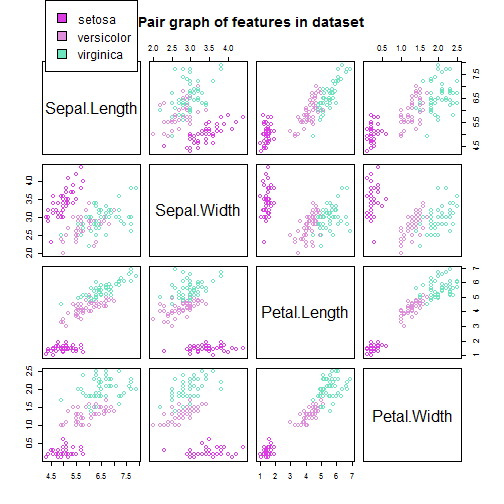

Typical Machine Learning Algorithms for Classification Problems
========================================================
author: Duc Doan
date: 2018 January 01
autosize: true

<style>
.small-code pre code {
  font-size: 1.25em;
}
</style>

Iris Dataset: Example
========================================================
class: small-code


```r
summary(iris)
```

```
  Sepal.Length    Sepal.Width     Petal.Length    Petal.Width   
 Min.   :4.300   Min.   :2.000   Min.   :1.000   Min.   :0.100  
 1st Qu.:5.100   1st Qu.:2.800   1st Qu.:1.600   1st Qu.:0.300  
 Median :5.800   Median :3.000   Median :4.350   Median :1.300  
 Mean   :5.843   Mean   :3.057   Mean   :3.758   Mean   :1.199  
 3rd Qu.:6.400   3rd Qu.:3.300   3rd Qu.:5.100   3rd Qu.:1.800  
 Max.   :7.900   Max.   :4.400   Max.   :6.900   Max.   :2.500  
       Species  
 setosa    :50  
 versicolor:50  
 virginica :50  
                
                
                
```

Exploratory Data Analytics
========================================================



Classification Algorithms
========================================================

- Multiple Logistic Regression

- Decision Tree

- Random Forest

- Support Vector Machine

- XGBoost


Classification Results
========================================================


```
            valid.logit
             setosa versicolor virginica
  setosa         13          0         0
  versicolor      0         15         0
  virginica       0          1        16
```

- the accuracy of classification algorithm is checked by using validation data
- The application provides a simple solution for classification problems
- The data for classification need preprocessing before putting the application.

